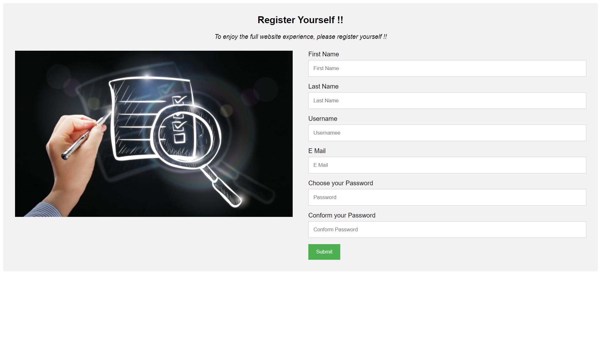
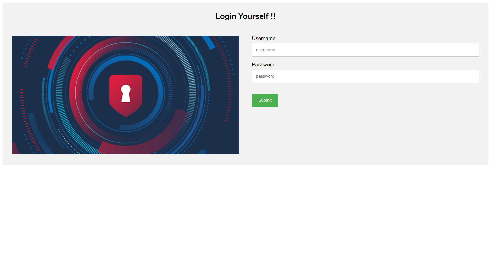
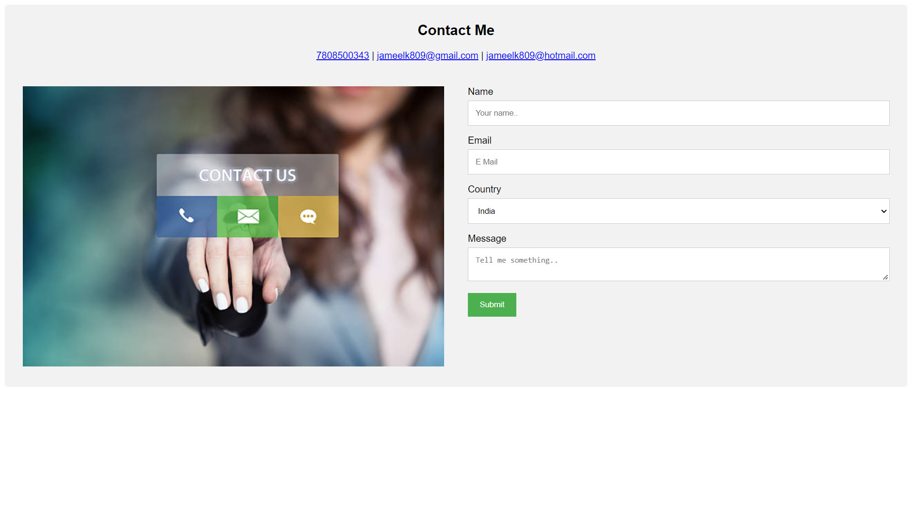

<p align="center">
  <h1 align="center">TRAVELSTER</h1>
A travel website designed using the Travello theme from Colorlib, with user login system, powered by Django.
---

## Features
- Beautiful UI.
- Register and Sign-In feature.
- Contact Us page.
- Mobile Compatible
- User Friendly
- Accessible to all users
- Fast load time
- Effective Navigation
- Browser Consistency
- Clean Code
---

## Built Using
- BOOTSTRAP
- DJANGO
- POSTGRESQL
- Python backend
- Psycopg2
- HTML/CSS
---

## Structure
```
kamran
├───accounts
│   ├───migrations
│   └───__pycache__
├───assets
│   ├───admin
│   │   ├───css
│   │   │   └───vendor
│   │   │       └───select2
│   │   ├───fonts
│   │   ├───img
│   │   │   └───gis
│   │   └───js
│   │       ├───admin
│   │       └───vendor
│   │           ├───jquery
│   │           ├───select2
│   │           │   └───i18n
│   │           └───xregexp
│   ├───images
│   ├───js
│   ├───plugins
│   │   ├───easing
│   │   ├───font-awesome-4.7.0
│   │   │   ├───css
│   │   │   ├───fonts
│   │   │   ├───less
│   │   │   └───scss
│   │   ├───greensock
│   │   ├───Isotope
│   │   ├───OwlCarousel2-2.2.1
│   │   ├───parallax-js-master
│   │   ├───progressbar
│   │   ├───scrollmagic
│   │   └───scrollTo
│   └───styles
│       └───bootstrap4
├───calc
│   ├───migrations
│   └───__pycache__
├───img
├───kamran
│   └───__pycache__
├───media
│   └───pics
├───static
│   ├───images
│   ├───js
│   ├───plugins
│   │   ├───easing
│   │   ├───font-awesome-4.7.0
│   │   │   ├───css
│   │   │   ├───fonts
│   │   │   ├───less
│   │   │   └───scss
│   │   ├───greensock
│   │   ├───Isotope
│   │   ├───OwlCarousel2-2.2.1
│   │   ├───parallax-js-master
│   │   ├───progressbar
│   │   ├───scrollmagic
│   │   └───scrollTo
│   └───styles
│       └───bootstrap4
├───templates
└───travello
    ├───migrations
    │   └───__pycache__
    └───__pycache__
```
---
## Screenshots
- Home Page


- Register Page


- Login Page


- Contact Page

---
## Contact
- I'm **Kamran Jameel**. <br>If you just want to say hi, please feel free to <a href="mailto:jameelk809@gmail.com">Email Me</a> !!
---